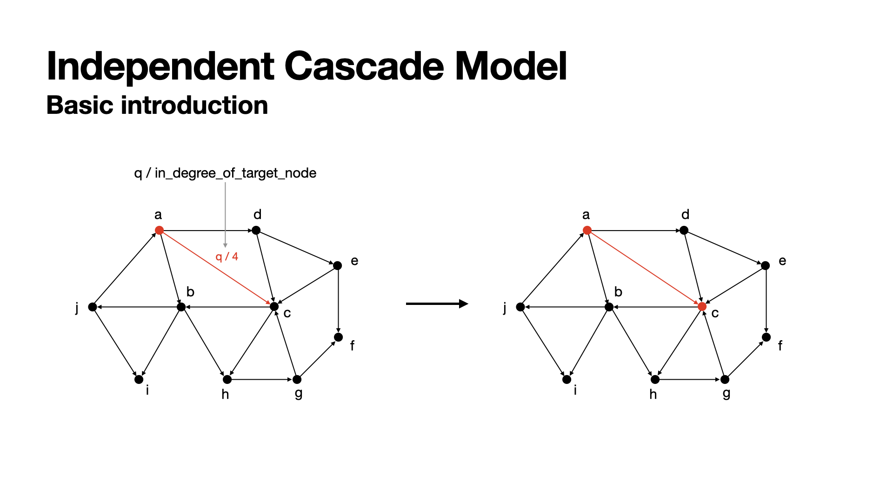
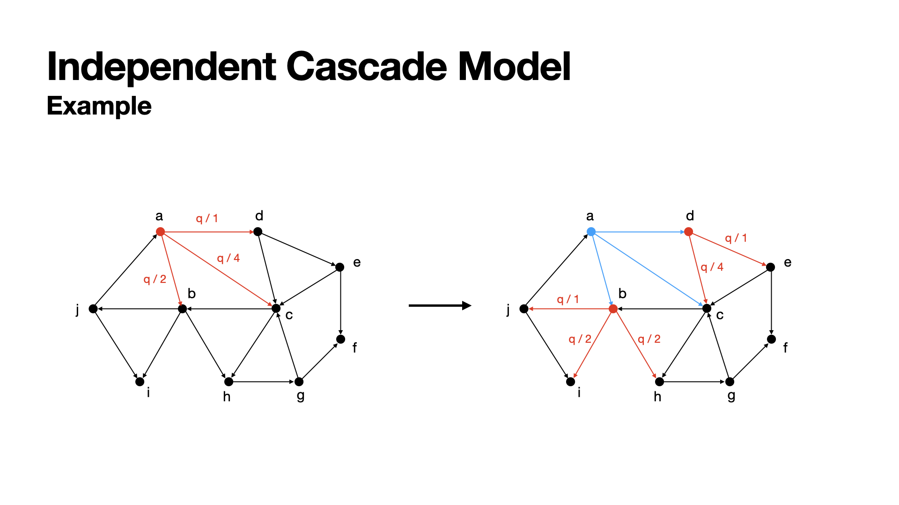
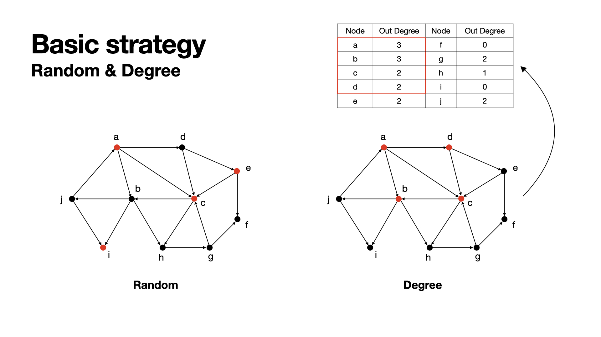
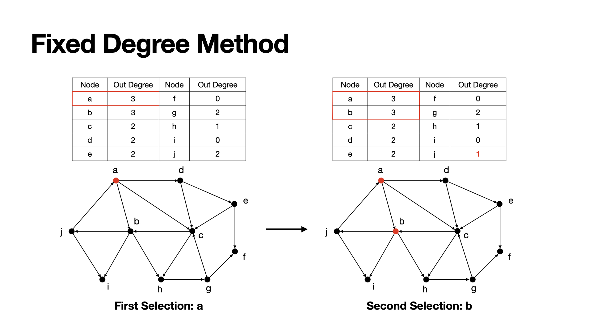
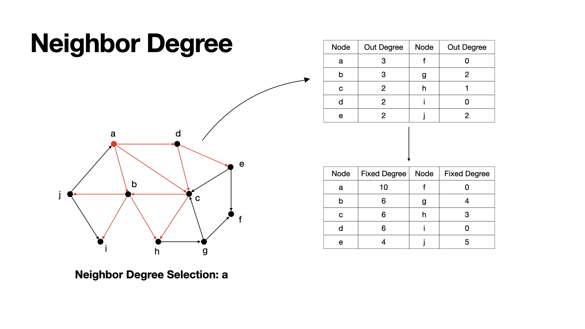
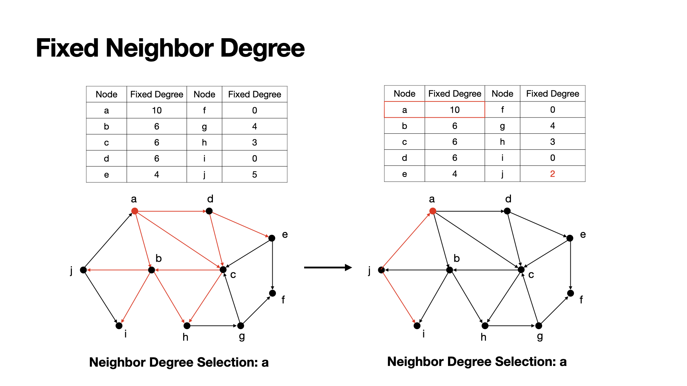
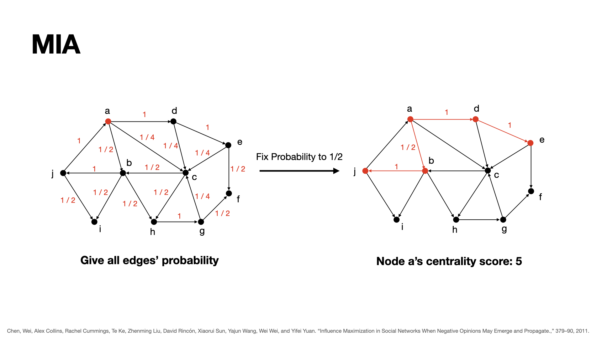
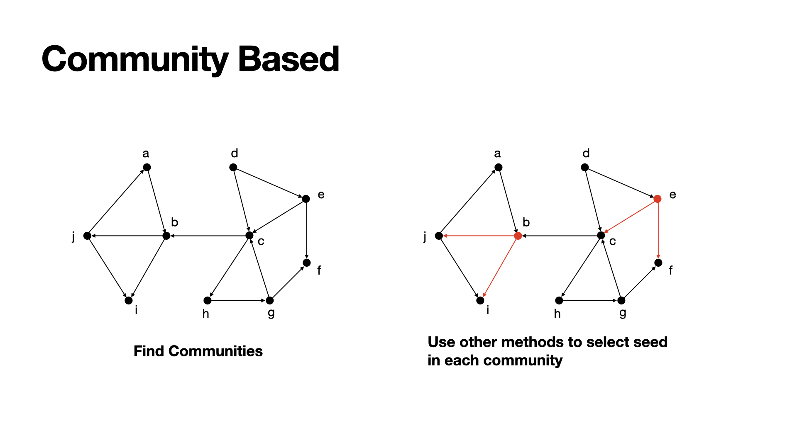

# 📡 Independent Cascade Model

This is the Python implement of Independent cascade model. 

## 💡 Introduction

Spreading through networks are common everywhere, like spread of diseases, viral marketing, news spreading, etc. To simulate the spreading in a network, we have to know the type of model diffusion: 

- **Decision based on models** - nodes can make their own decision;
- **Probabilistic models** - infected node push the contagion to uninfected nodes. 

**Independent Cascade Model** is one of the most famous and widely researched models, which is a probabilistic model. You may find more detail in the next part. 

## 📖 Cascade

The independent cascade steps are as following:

1. Select some nodes as the initial actived nodes, which are **Seeds**;
2. The propagation of an edge will be successfully cascaded with the probability `q/in_degree_of_target`, where `q` is a hyper parameter called `threshold` (we always set it to `0.2`, `0.4`, `0.6`, `0.8`, or `1.0`);
3. In each round, the propagation will be cascaded only once, and the active nodes in the round will be set to actived node, which would **not** cascade to other ndoes any more, even the nodes did not cascade to any other nodes. 
4. Keep cascading, until there is no nodes can active others. At this time, the number of actived nodes are the final incluence number. 

There are three status of node: 

- **Inactive** - common nodes;
- **Active** - seeds or nodes were actived at the last one round, these nodes can active other nodes at the next round;
- **Actived** - nodes have actived other nodes at previous round, these nodes are actived but can not active other nodes.

### Example 1

In this graph, the in-degree of node `c` is 4, so the propagation of the edge `a->c` would be  `q/4`. In the next round, `c` has this probability to be actived by `a`.



### Example 2

In this graph, at the first round (left part), node `a` has chances to active nodes `b`, `c`, `d` with the probability `q/2`, `q/4`, `q/1`. 

We assume that at the first round, node `a` successfully actived `b` and `d`, but failed for activing `c`. So, at the next round (right part), `a` become actived and can not active other nodes any more, and now `b` and `c` can active their neighbors. 



## 📈 Influence Maximization

Since the cascade algorithm is give, if we want to make our cascading works more efficiently and more effectivly, what we can do is choosing better seeds, i.e. choosing initial active nodes that results in a higher number of ultimate active nodes. 

Here will show to you some selection policies. 

### Random

Do nothing, randomly choose some nodes. Hmmm, maybe useful.

### Degree

Since we want our nodes to active as more as possible, the out-degree of nodes coule be considered. 

The idea of this is simple, when we get a graph, we calculate all nodes' out-degree and rank them, select those nodes with highest out-degrees. Higher out-degrees means can get in touch to more other nodes. 



### Fixed Degree

Using degree ranking method has a problem, which is, if some nodes connected with each other in a small scale, those nodes will all have high out-degree. But when we choose them to be seeds, the result would be not such good, since actived nodes will not be considered any more, finally in this area the rest nodes would be meaningless. 

To fix this problem, we can update nodes' out-degree after each selection, i.e.  after selecting one node as a seed, we will update the out degree of such nodes who connected to this seed with `-1` to make sure those source nodes will not consider this seed any more. 

By this way we can avoide some local seeds gathering. 

**Example:** `a` has the highest degree now, so we choose `a` as a seed, then since `a` is meaningless for `j` to active, we set the out degree of `j` to `1` to fix it. 



### Neighbor Degree

Only consider the degree of nodes themselves would be restricted. To get better result, we can also consider the degree of neighbors. 

We select seed by nodes' centrality score. Here, we can get nodes' centrality scores by adding up themselves' degree and their neighbors' degree. This can help we have a wider range conceptions about graph. 

**Example:** `a` has neighbor `b`, `c`, `d`, and their out-degree are 3, 2, 2, so, `a`'s centrality score here would be 3+3+2+2 = 10.



### Fixed Neighbor Degree

Common neighbor degree also has the problem like degree method, which is re calculated actived nodes. We can redo the fix method of fix degree method here to solve the problem. 

After choosing a seed, we update the centrality score of those nodes who connected to the seed. 

**Examples:** `a` has the highest centrality score, so we choose `a` as a seed, after then, we can set `j`'s centrality to 2, since `a` is meaningless for `j` to active. 



### MIA

Consider previous methods, we can find the effectiveness of considering degree. But for now, we just consider 2 depth's degree, i.e. node and it's neighbors. Try to apply this thought to infinity depth, we can find the selection policy by path. 

For each node, we will consider its possible influence sub-graph, which contains nodes who has a probability higher than `q` can be actived by the origin node. To get this network, we will calculated the probability for each edge, which is `threshold/in-degree`, and for each path, the probability of path should be `p1 * p2 * ... * pk`, where `pi` is the probability of edges in the path. 

For each node, the centrality of it would be the number of nodes in its influence sub-graph. Rank them to get the best seed to choose. 

**Example:** in this graph, from `a`, there are two paths with the probability higher than 0.5, which are `a -> b -> j`, and `a -> d -> e` , there are 5 nodes in total, so we set the centrality of `a` to 5.



### Community Based

Community would be a problem for us to choose a better seeds set, since whenever we choose seeds within a community, the effects would get discount. So, consider the communities in a graph would be helpful. 

The most basic method beased on community would be simple: 

1. Find several communities in a graph;
2. Choose the mose effective seeds in each community;
3. Sum up such nodes to get a perfect seeds set. 

During this process, there are many other features we should consider, like the size of each community, the connection level between communities, etc. Here is a most basic method, wait for future's work. 

**Example:** In this graph, there are two communities, we find `b` would be the best seed in the left community and `e` would be the best seed in the right community. Add them up we can get the seeds set.   



## 🔧 Environment Requirement 

```python
Python Version: tested on 3.6, 3.9
Python Packages required: numpy
```

## 🔦 How to Use

**Step 1**. [Download](https://github.com/cbhua/model-independent-cascade/releases) or [Clone](https://github.com/cbhua/model-independent-cascade.git) the repository; 

**Step 2**. Refer to `notebook/example.ipynb` to check the example of using this repo. 

**Step 3**. Modify what you want, here are parameters you may want to change in the notebook: 

- `dataset` - the name of dataset file, with the format `int(source node id) \t int(target node id) \n` for each line, i.e. each line is an edge in the graph, from the first integer number (source node id) to the second integer number (target node id), those two integers are splited by `\t`;

- `policy` - the seeds selection policy, here we provide the methods `degree`, `random`, `degree_discount`, `degree_neighbor`, `degree_neighbor_fix`, and  `mia`;

- `threshold` - the threshold, set it between 0 and 1;

- `init_rate` - the number of seeds, which is `init_rate * number_of_nodes`, recommend to set it between 0.000 and 0.050, too many initial seeds will extramely increase the amount of calculation. 

## 📚 Other

Any bug report or contribution are welcome!
